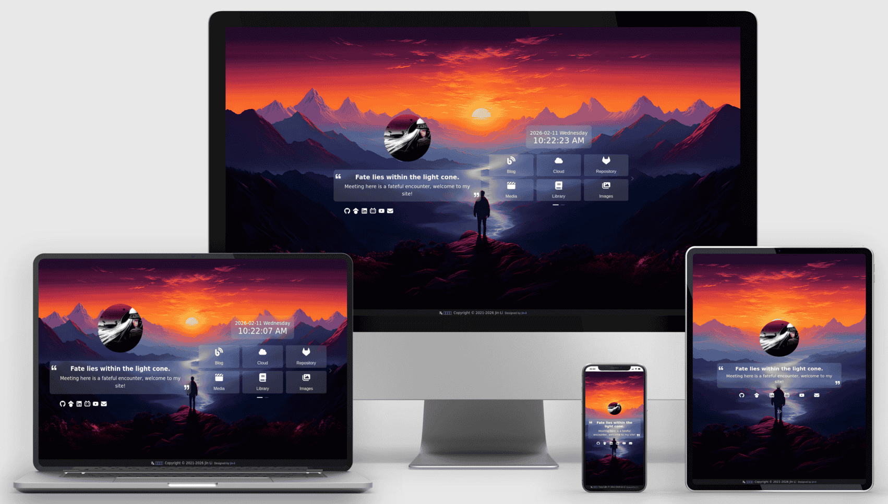
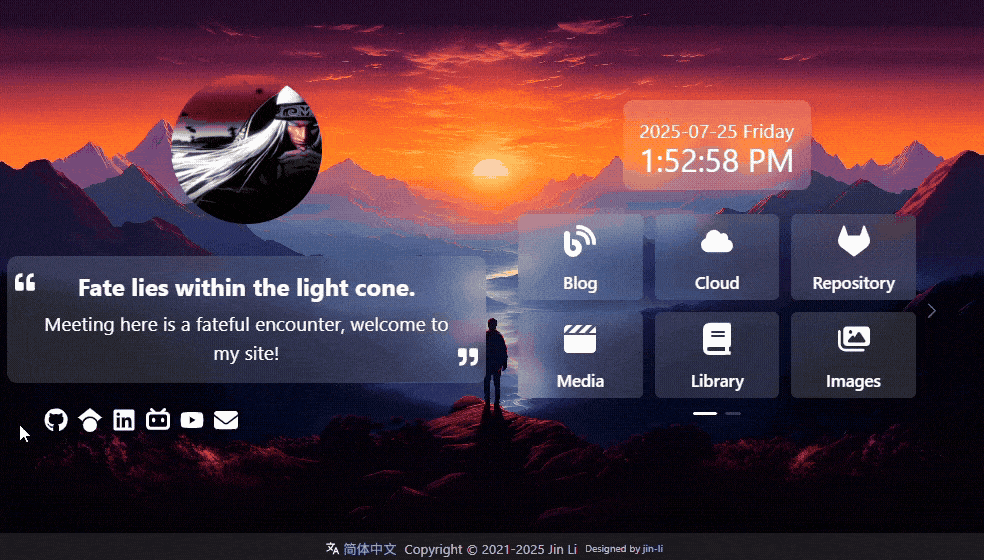
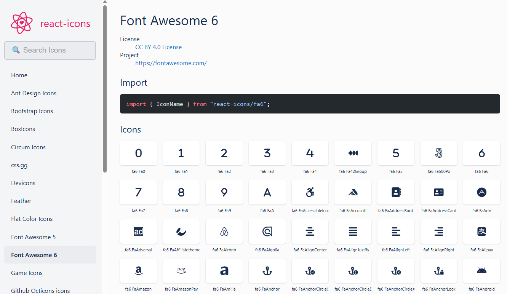

语言：[简体中文 🇨🇳](README.zh.md) | Language: [English 🇺🇸](README.md)

# 锦鲤主页

锦鲤主页是一个轻量、优雅、可自定义的主页项目，支持多语言（i18n）。





[在线演示](https://jinli.io)

## 特性

- **轻量**：主页设计简洁，依赖最小化，开箱即用。
- **优雅**：界面清爽现代，注重可读性与可用性。
- **可自定义**：可通过 JSON 或 YAML 轻松定制，打造你的个人风格。
- **多语言支持**：支持多语言，便于面向更广泛用户。
- **响应式设计**：兼容桌面端与移动端等不同设备。
- **技术栈**：基于 React、Vite、Ant Design 与 TypeScript，兼顾速度与体验。
- **Docker 支持**：支持 Docker / docker-compose，便于在任意环境部署。

## 快速开始

### 使用 Docker 部署（推荐）

```bash
git clone https://github.com/jin-li/jinli-homepage.git
cd jinli-homepage
docker compose build
docker compose up -d
```

默认情况下，主页将运行在 `http://localhost:12444`。你可以在 `docker-compose.yml` 中修改端口。

### 本地运行

```bash
git clone https://github.com/jin-li/jinli-homepage.git
yarn install
yarn dev
```

默认情况下，主页将运行在 `http://localhost:5173`。你可以在 `vite.config.ts` 中修改端口。

### 构建生产版本

```bash
git clone https://github.com/jin-li/jinli-homepage.git
yarn install
yarn build
```

生产构建产物会生成在 `dist` 目录。你可以使用任意静态文件服务（如 `serve` 或 `http-server`）进行部署。

```bash
yarn global add serve
serve -s dist
```

## 自定义配置

本主页高度可定制。配置文件位于 `public/locales` 目录。`public` 目录结构如下：

```sh
public
├── assets
│   ├── avatar.jpg               # 你的头像
│   ├── bg.jpg                   # 背景图
│   ├── favicon.ico              # 浏览器标签页图标
│   └── logo192.png
└── locales
    ├── en
    │   ├── description.json     # 标语/简介
    │   ├── footer.json          # 页脚
    │   ├── links.json           # 你的应用或网站链接
    │   ├── logo.json            # 头像 logo
    │   ├── site.json            # 站点配置（作者、背景等）
    │   ├── socials.json         # 社交图标与链接，图标来自 react-icons fa6
    │   ├── time.json            # 时间模块
    │   └── ui.json              # 版权信息
    └── zh
        ├── description.json
        ├── footer.json
        ├── links.json
        ├── logo.json
        ├── site.json
        ├── socials.json
        ├── time.json
        └── ui.json
```

- `assets`：用于存放主页静态资源，如图片与图标。
- `locales`：用于存放多语言配置。每种语言一个子目录（如 `en`、`zh`），每个子目录按模块拆分 JSON 文件，如 `description.json`、`footer.json`、`links.json` 等。

你可以通过修改这些 JSON 配置文件，或替换 `assets` 下的图片来定制主页。

本项目使用的图标来自 [React Icons](https://react-icons.github.io/react-icons/) 库，具体为 Font Awesome 6（fa6）图标集合：



社交图标与链接配置在 `public/locales/en` 和 `public/locales/zh` 下的 `socials.json` 与 `links.json` 中。
如果你想新增或修改社交图标/链接，可以在 [React Icons](https://react-icons.github.io/react-icons/) 中搜索图标，并在 JSON 文件中填写对应图标名。

修改配置后需要重新构建项目。

## 问题反馈与功能建议

如果你遇到问题或有功能建议，欢迎到 [GitHub 仓库](https://github.com/jin-li/jinli-home/issues) 提交 Issue。
提交时请尽量遵循 Issue 模板，以便更快定位与处理。

## 开发贡献

如果你希望参与项目开发，可按以下步骤进行：

1. 在 GitHub 上 Fork 本仓库。
2. 将你 Fork 后的仓库克隆到本地。
3. 创建新分支用于功能开发或问题修复。
4. 完成修改并提交清晰的 commit message。
5. 推送分支到你的远程仓库。
6. 向原仓库提交 Pull Request。

主要源码结构如下：

```bash
./
├── public
│   ├── assets            # 背景、头像、站点图标
│   └── locales           # 站点配置，按语言分类
└── src
    ├── main.tsx          # React 默认入口
    ├── index.css         # React 默认样式
    ├── App.tsx           # 页面整体视图
    ├── App.module.scss   # 全局样式
    ├── i18n.ts           # 基于 i18next 的多语言支持
    ├── styles            # CSS 样式（颜色、字体等）
    ├── view              # 面板与响应式布局
    ├── components        # 组件（logo、简介、社交链接、时间模块、快捷链接、页脚等）
    └── hooks             # hooks
```

## 致谢

- 本项目灵感来自 [無名の主页](https://github.com/imsyy/home)。
- 多设备响应式展示图由 [Mokkify](https://mokkify.com/mockups/devices/multi-devices) 生成。
- 图标来源于 [React Icons](https://react-icons.github.io/react-icons/) 的 Font Awesome 6（fa6）图标集合。

## 许可证

本项目采用 MIT 许可证。详情请见 [LICENSE](LICENSE) 文件。
